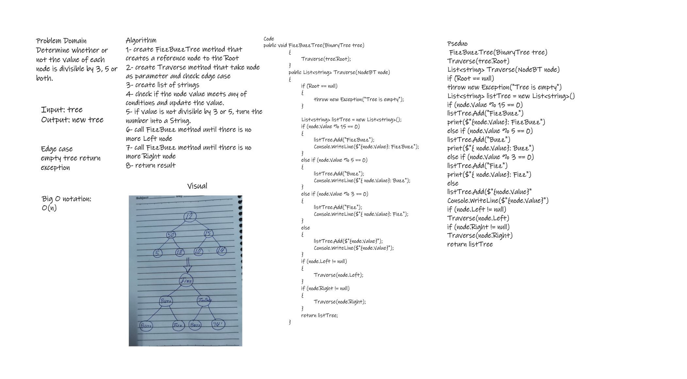

# Challenge Summary

#### Determine whether or not the value of each node is divisible by 3, 5 or both.

1- If the value is divisible by 3, replace the value with “Fizz”

2- If the value is divisible by 5, replace the value with “Buzz”

3- If the value is divisible by 3 and 5, replace the value with “FizzBuzz”

4- If the value is not divisible by 3 or 5, simply turn the number into a String.

# Whiteboard Process

# Approach & Efficiency

Time Complexity : O(n)

Space Complexity : O(n)

# Solution

