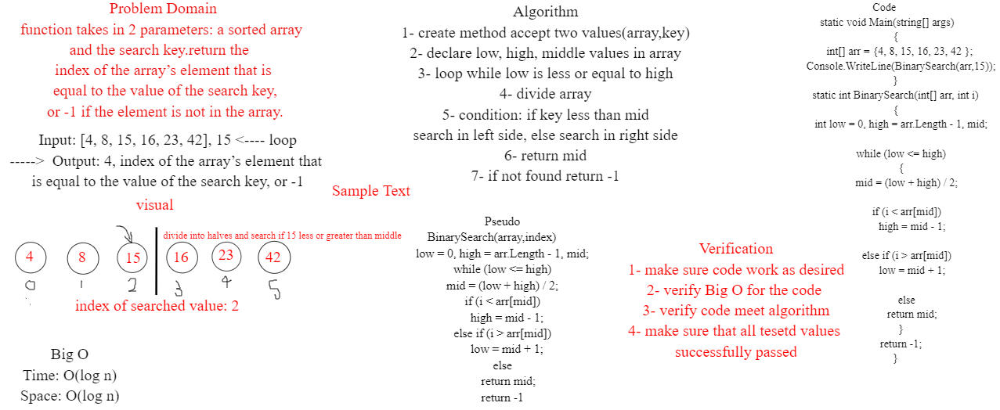

# Binary Search of Sorted Array
### Write a function called BinarySearch which takes in 2 parameters: a sorted array and the search key. return the index of the array’s element that is equal to the value of the search key, or -1 if the element is not in the array.

### Whiteboard Process

### Approach & Efficiency
1- create method accept two values(array,key)

2- declare low, high, middle values in array

3- loop through this array, while low is less or equal to high

4- divide array

5- if statement: if key less than middle search in left side, else search in right side

6- return mid

7- if key not found return -1 

### Edge cases:
1- Empty Array 

2- Array with one element

3- All array elements are the same 

#### Big O represents the complexity of a function that increases linearly and in direct proportion to the number of inputs.
#### space O(log n)
#### time O(log n)
