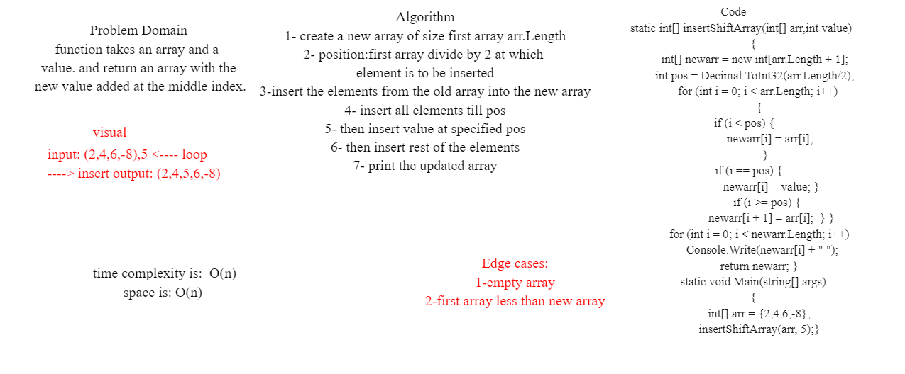

# Array Insert Shift

### a function called insertShiftArray which takes in an array and a value to be added. Without utilizing any of the built-in methods available to your language, return an array with the new value added at the middle index.

### Whiteboard Process

### Approach & Efficiency

1- createfunction take array and value, declare a new array of size first array arr.Length

2- position:first array divide by 2 at which element is to be inserted

3-insert the elements from the old array into the new array

4- make condition to: 
  * insert all elements till pos

  * then insert value at specified pos

  * then insert rest of the elements

5- return updated array

#### Big O represents the complexity of a function that increases linearly and in direct proportion to the number of inputs.
#### space O(n)
#### time O(n)
