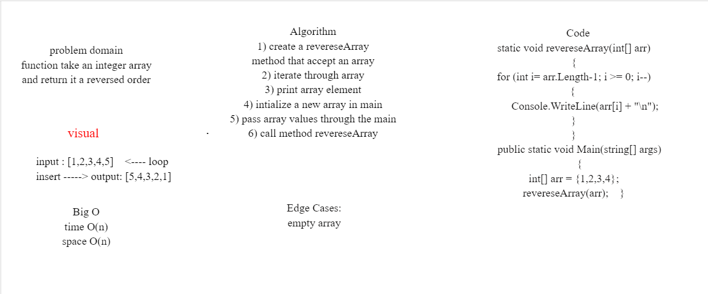

# Reverse an Array
###  a function called reverseArray which takes an array as an argument. Without utilizing any of the built-in methods, return an array with elements in reversed order.

# Whiteboard Process

# Approach & Efficiency
* create method name is reversedArray
* take an array as parameter 
* loop through this array
* then i print the array
* inside main i declared an array 
* i filled the array with {1,2,3,4,5}
* then i call the method and pass the array to it.
### Big O represents the complexity of a function that increases linearly and in direct proportion to the number of inputs.
### space O(n) 
### time O(n)