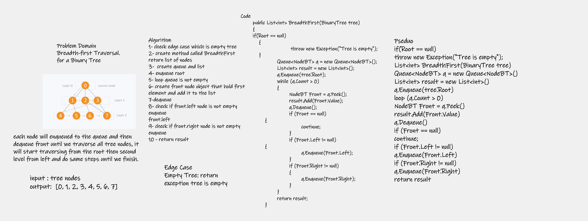

# Challenge Summary

Breadth-first Traversal.

Breadth first traversal iterates through the tree by going through each level of the tree node-by-node.

# Whiteboard Process

# Approach & Efficiency

BreadthFirst : O(w)

# Solution

