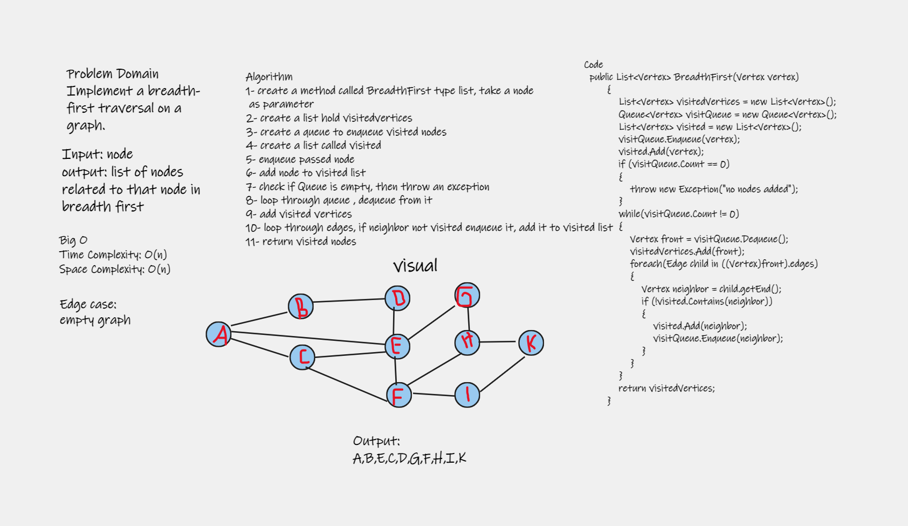

# Breadth-First Traversal of a Graph

## Challenge Summary

Implement a breadth-first traversal on a graph.

## Whiteboard Process



## Approach & Efficiency

### Time Complexity: O(n)

### Space Complexity: O(n)

## Solution

```
   public List<Vertex> BreadthFirst(Vertex vertex)
        {
            List<Vertex> visitedVertices = new List<Vertex>();
            Queue<Vertex> visitQueue = new Queue<Vertex>();
            List<Vertex> visited = new List<Vertex>();
            visitQueue.Enqueue(vertex);
            visited.Add(vertex);
            if (visitQueue.Count == 0)
            {
                throw new Exception("no nodes added");
            }
            while(visitQueue.Count != 0)
            {
                Vertex front = visitQueue.Dequeue();
                visitedVertices.Add(front);
                foreach(Edge child in ((Vertex)front).edges)
                {
                    Vertex neighbor = child.getEnd();
                    if (!visited.Contains(neighbor))
                    {
                        visited.Add(neighbor);
                        visitQueue.Enqueue(neighbor);
                    }
                }
            }
            return visitedVertices;
        }
```
