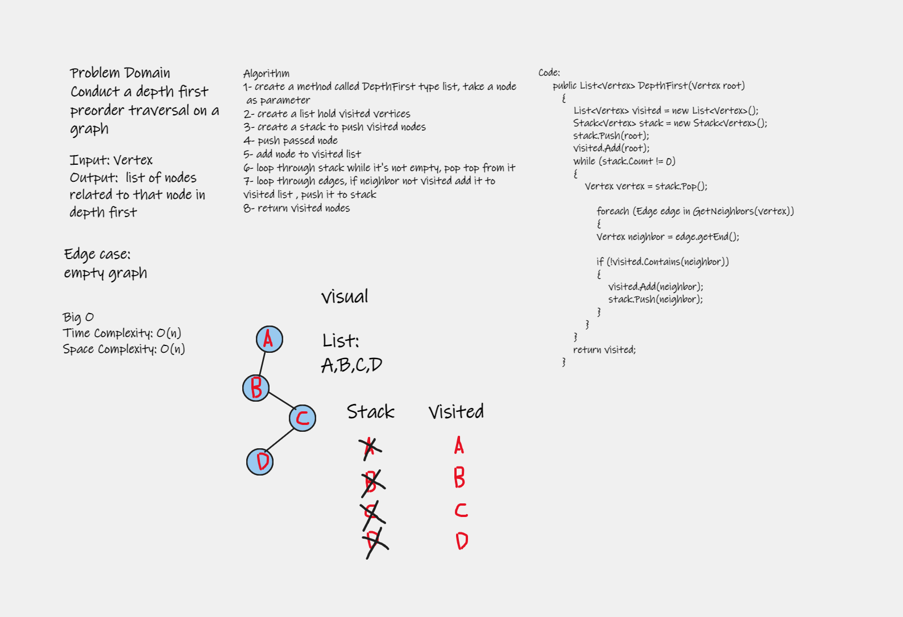

# Depth First Traversal

Depth First Search (DFS) algorithm traverses a graph in a depthward motion and uses a stack to remember to get the next vertex to start a search, when a dead end occurs in any iteration.

# Challenge 

Conduct a depth first preorder traversal on a graph

# Approach & Efficiency

1- create a method called DepthFirst type list, take a node as parameter

2- create a list hold visited vertices

3- create a stack to push visited nodes

4- push passed node

5- add node to visited list

6- loop through stack while it's not empty, pop top from it

7- loop through edges, if neighbor not visited add it to visited list , push it to stack 

8- return visited nodes 

# Solution

