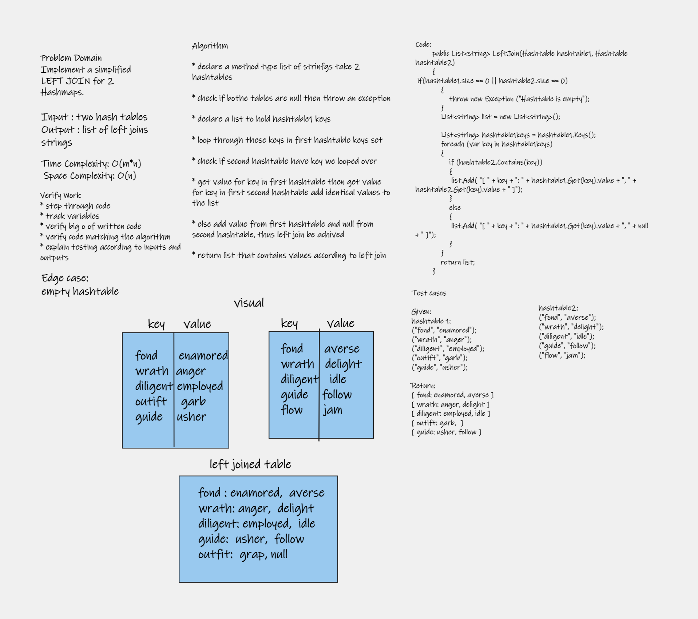

# Hashmap LEFT JOIN

LEFT JOIN returns all rows from the left table, even if there are no matches in the right table. This means that if the ON clause matches 0 (zero) records in the right table; the join will still return a row in the result, but with NULL in each column from the right table.

This means that a left join returns all the values from the left table, plus matched values from the right table or NULL in case of no matching join predicate.

## Challenge

Implement a simplified LEFT JOIN for 2 Hashmaps.

## Approach & Efficiency

function that LEFT JOINs two hashmaps into a single data structure.

function called left join

Arguments: two hash maps

The first parameter is a hashmap that has word strings as keys, and a synonym of the key as values.

The second parameter is a hashmap that has word strings as keys, and antonyms of the key as values.

Return: The returned data structure that holds the results is up to you. It doesn’t need to exactly match the output below, so long as it achieves the LEFT JOIN logic

### Time Complexity: O(m*n) 

### Space Complexity: O(n)

## Solution

