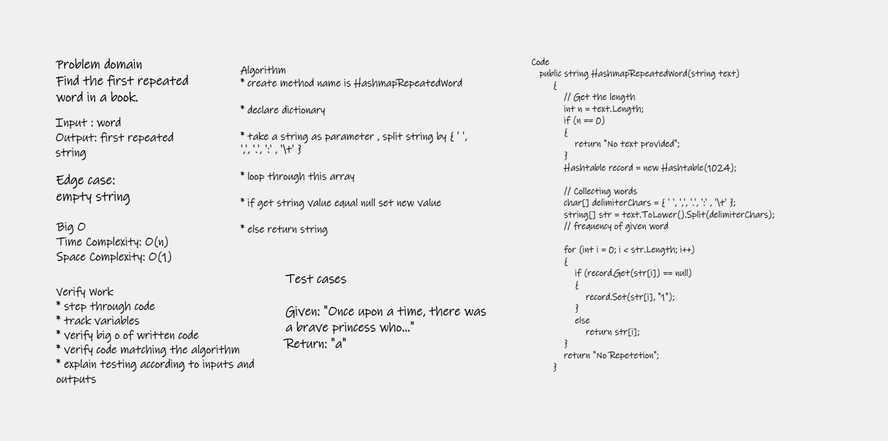

# Challenge summary

###  a function called repeated word that finds the first word to occur more than once in a string

# Whiteboard Process

# Approach & Efficiency

* create method name is HashmapRepeatedWord

* declare dictionary

* take a string as parameter , split string by { ' ', ',', '.', ':' , '\t' }

* loop through this array

* if get string value equal null set new value

* else return string
# Big O represents the complexity of a function that increases linearly and in direct proportion to the number of inputs.

### Time Complexity: O(n) 

### Space Complexity: O(1)

# Solution

to run code ctrl + f5 

[Code](HashmapRepeated.cs)