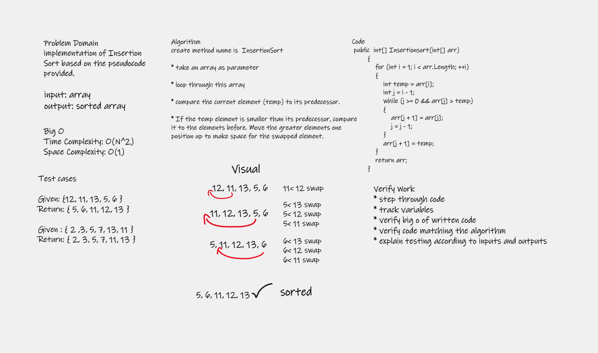
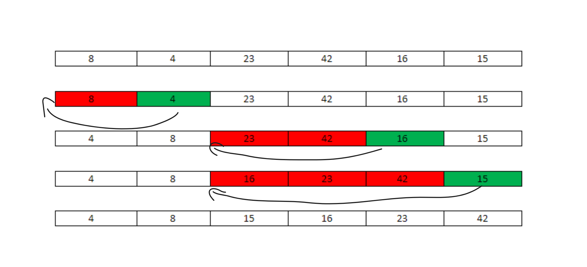
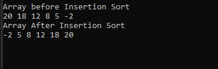
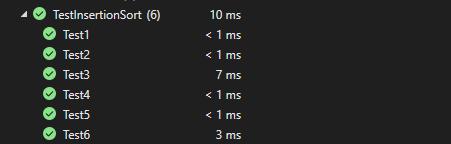

# Insertion Sort
### is a simple sorting algorithm that works similar to the way you sort playing cards in your hands. The array is virtually split into a sorted and an unsorted part. Values from the unsorted part are picked and placed at the correct position in the sorted part.

# Problem Domain
### implementation of Insertion Sort based on the pseudocode provided.

# Whiteboard Process

# Approach & Efficiency

* create method name is  InsertionSort

* take an array as parameter 

* loop through this array

* compare the current element (temp) to its predecessor.

* If the temp element is smaller than its predecessor, compare it to the elements before. Move the greater elements one position up to make space for the swapped element.

# Big O represents the complexity of a function that increases linearly and in direct proportion to the number of inputs.

### Time Complexity: O(N^2) 

### Space Complexity: O(1)

# Working of Insertion Sort algorithm:

### given array : [8,4,23,42,16,15]

First Pass:

Initially, the first two elements of the array are compared in insertion sort.

8,4,23,42,16,15

Here, 8 is greater than 4 hence they are not in the ascending order and 8 is not at its correct position. Thus, swap 4 and 8.
So, for now 11 is stored in a sorted sub-array.

4,8,23,42,16,15  

Second Pass:

Now, move to the next two elements and compare them

Here, 23 is greater than 8,thus both elements seems to be in ascending order, hence, no swapping will occur. 23 also stored in a sorted sub-array along with 8

4,8,23,42,16,15

Third Pass:

Now, two elements are present in the sorted sub-array which are 4, 8, 23
Moving forward to the next two elements which are 42 and 16

4,8,23,42,16,15  

Both 42 and 16 are not present at their correct place so swap them

4,8,23,16,42,15   

After swapping, elements 16 and 23 are not sorted, thus swap again

4,8,16,23,42,15

Here, again 42 and 15 are not sorted, hence swap again

4,8,16,23,15,42   

here, it is at its correct position

Fourth Pass:

Now, the elements which are present in the sorted sub-array are 4,8,16
Moving to the next two elements 23 and 15

4,8,16,23,15,42  

Clearly, they are not sorted, thus perform swap between both

4,8,16,15,23,42 

Now, 15 is smaller than 16, hence, swap again

4,8,15,16,23,42  

Finally, the array is completely sorted.

visual:
 

# Result 

# Test 

