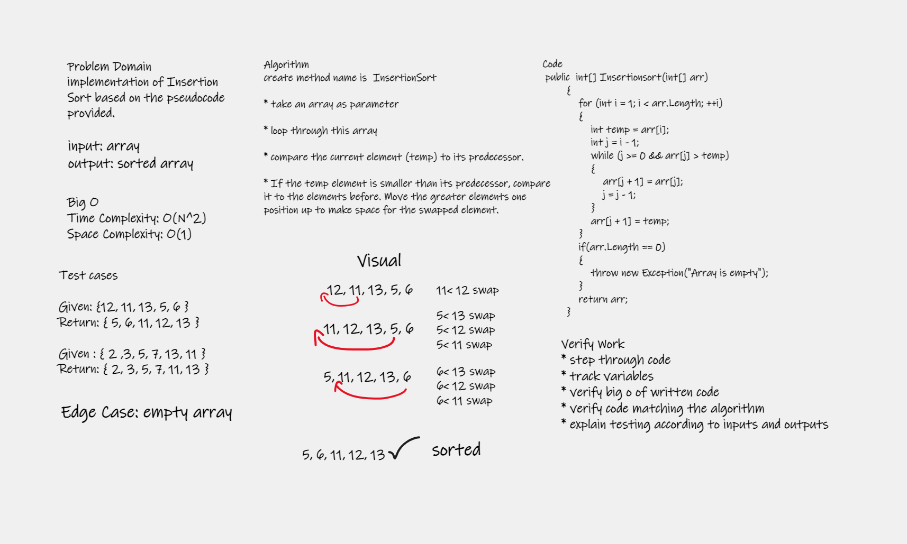

# Challenge summary

### implementation of Insertion Sort based on the pseudocode provided.

# Whiteboard Process

# Approach & Efficiency

* create method name is  InsertionSort

* take an array as parameter 

* loop through this array

* compare the current element (temp) to its predecessor.

* If the temp element is smaller than its predecessor, compare it to the elements before. Move the greater elements one position up to make space for the swapped element.

# Big O represents the complexity of a function that increases linearly and in direct proportion to the number of inputs.

### Time Complexity: O(N^2) 

### Space Complexity: O(1)

# Solution

to run code ctrl + f5 

[BLOG](BLOG.md)