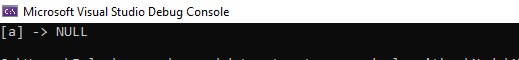

# Singly Linked List: 

### only go in one direction, node has only one reference, reference points to the next. start at the head node, and traverse from the root until the last node

# Challenge

### Create a Node class that has properties for the value stored in the Node, and a pointer to the next Node.

### Create a Linked List class, include a head property, and three functions: add node, search for node, print all nodes

# Approach & Efficiency

### create a node class that has next pointer and data to be inserted to the linked list

### create a linked list class, have reference to head node and contructor to intialize head to null, and has 3 fuctions for insert node,search for node,print all nodes.

### Methods
 
| Method | Summary | Big O Time | Big O Space | Example 
| ----------- | ----------- | ----------- |  ----------- |  ----------- |
| Insert | Adds a new Node to the Linked List | O(1) | O(1) | linkedList.Insert("a") |
| Includes | Takes in a value and returns a boolean depending on if the value is in the LinkedList | O(n) | O(1) | linkedList.Includes("a") |
| ToString | Prints the Linked List to the console | O(n) | O(1) | linkedList.ToString() 

# API

### i create a node class that has next pointer and data to be inserted to the linked list, and linked list class, have reference to head node and contructor to intialize head to null, and has 3 fuctions for insert node,search for node,print all nodes.

1- Insert: The Insert Method takes in an string as a parameter. A new Node is then created using the string param as its Value. The new Node is then placed in the Linked List at the Head and the previous Head is assigned as the new Nodes Next.

2- Includes: The Includes Method takes in an string as a parameter then iterates through the Nodes of the Linked List checking all the Values. If the value is found True is returned, if not then False is returned.

3- ToString: The Print Method displays a well formatted depiction of the current state of the Linked List by iterating over all Nodes.

### in main i instatiate an empty list, and then fill it using Insert function,then i print all nodes, then i searched for x value
