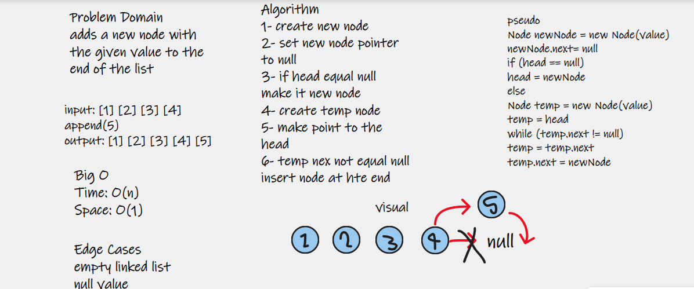
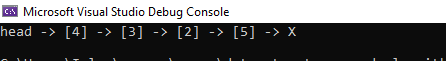
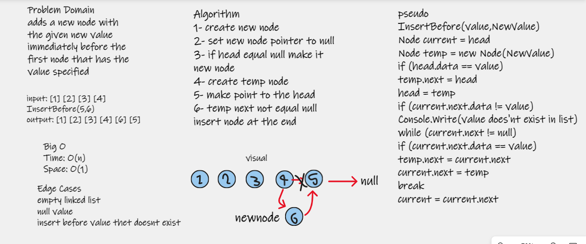
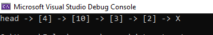
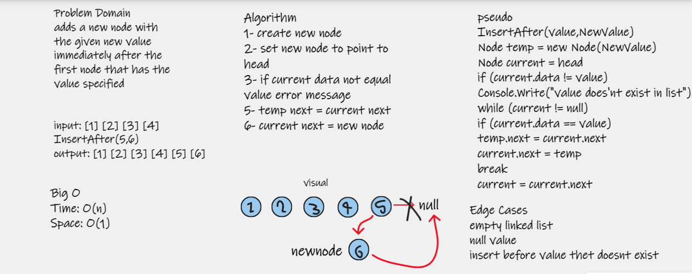

# Challenge Summary
### update linked list class with three functions: insert  before any node, insert  after any node , append node

## Approach & Efficiency
1- create append function: adds a new node with the given value to the end of the list

2- adds a new node with the given new value immediately before the first node that has the value specified

3- adds a new node with the given new value immediately after the first node that has the value specified

### Methods
 
| Method | Summary | Big O Time | Big O Space | Example 
| ----------- | ----------- | ----------- |  ----------- |  ----------- |
| Append | Adds a new Node to the Linked List at the last | O(n) | O(1) | linkedList.Append("5") |
| InsertBefore | Insert before given node | O(n) | O(1) | linkedList.InsertBefore("3","10") |
| InsertAfter | Insert after given node | O(n) | O(1) | linkedList.InsertAfter("2","10") 

## Solution

to run code press ctrl + f5

### Append whiteboard

### append 5 at last

### insert before white board

### insert 10 before 3 

### insert after whiteboard

### insert 10 after last node

## program contain unit tests for these methods
