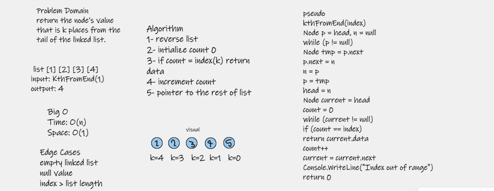

# Challenge Summary
### update linked list class with this function: return node position from tail

## Approach & Efficiency
1- create a function that return the node’s value that is k places from the tail of the linked list.

### Methods
 
| Method | Summary | Big O Time | Big O Space | Example 
| ----------- | ----------- | ----------- |  ----------- |  ----------- |
| ll.kthFromEnd(k) | Adds a new Node to the Linked List at the last | O(n) | O(1) | ll.kthFromEnd(2) |

## Solution

to run code press ctrl + f5

### whiteboard

### return position of 2 from linked list tail

