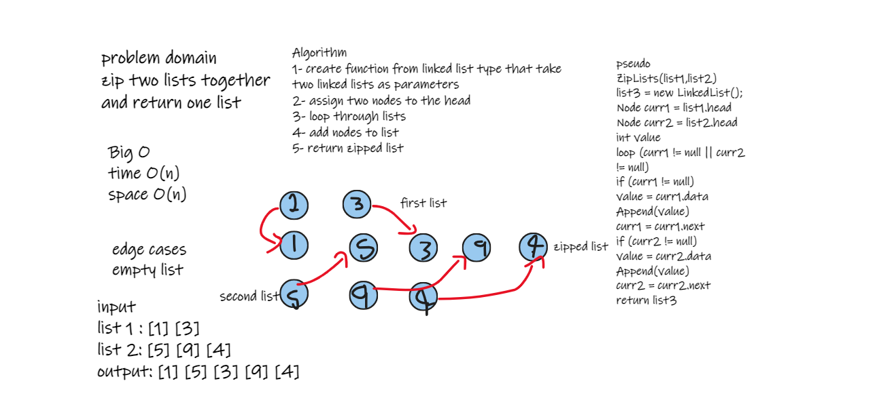

# Challenge Summary
### update linked list class with this function: Zip two linked lists.

## Approach & Efficiency
1- create a function that return the zipped list, by concatenate two lists togother
### Methods
 
| Method | Summary | Big O Time | Big O Space |  
| ----------- | ----------- | ----------- |  ----------- |
| list.ZipLists(list1,list2) | return zipped list | O(n) | O(1) |

## Solution

to run code press ctrl + f5

### whiteboard

### return zipped list

