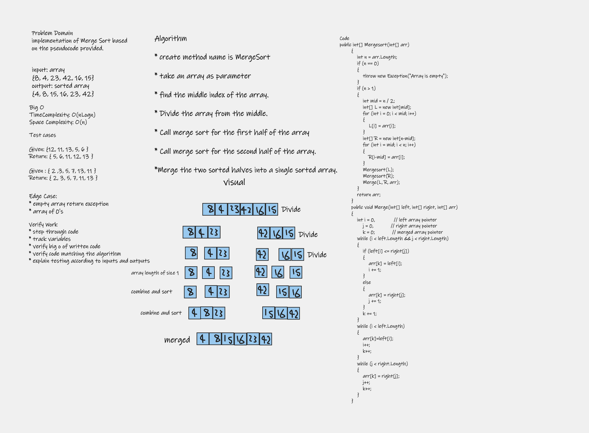

# Challenge Summary

### implementation of Merge Sort based on the pseudocode provided.

# Whiteboard Process

# Approach & Efficiency

* create method name is MergeSort

* take an array as parameter 

* find the middle index of the array.

* Divide the array from the middle.

* create two temp arrays 

* store first part in first array

* store second part in second array

* Call merge sort for the first half of the array

* Call merge sort for the second half of the array.

* Merge the two sorted halves into a single sorted array.

# Efficency

### Time Complexity: O(nLogn) 

### Space Complexity: O(n)

# Result 

# Test 

[BLOG](BLOG.md)