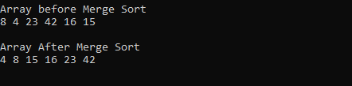
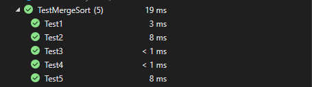

# Merge Sort

### is a Divide and Conquer algorithm. It divides the input array into two halves, calls itself for the two halves, and then it merges the two sorted halves.

# Problem Domain

### implementation of Merge Sort based on the pseudocode provided.

# Pseudo Code

```
ALGORITHM Mergesort(arr)
    DECLARE n <-- arr.length

    if n > 1
      DECLARE mid <-- n/2
      DECLARE left <-- arr[0...mid]
      DECLARE right <-- arr[mid...n]
      // sort the left side
      Mergesort(left)
      // sort the right side
      Mergesort(right)
      // merge the sorted left and right sides together
      Merge(left, right, arr)

ALGORITHM Merge(left, right, arr)
    DECLARE i <-- 0
    DECLARE j <-- 0
    DECLARE k <-- 0

    while i < left.length && j < right.length
        if left[i] <= right[j]
            arr[k] <-- left[i]
            i <-- i + 1
        else
            arr[k] <-- right[j]
            j <-- j + 1
```
# Whiteboard Process


# Approach & Efficiency

* create method name is MergeSort

* take an array as parameter 

* find the middle index of the array.

* Divide the array from the middle.

* create two temp arrays 

* store first part in first array

* store second part in second array

* Call merge sort for the first half of the array

* Call merge sort for the second half of the array.

* Merge the two sorted halves into a single sorted array.


# Efficency

### Time Complexity: O(nLogn) 

### Space Complexity: O(n)

# Working of Merge Sort algorithm:

### given array : [8,4,23,42,16,15]

* find mid of the array which is at index 3

* recursively divide the array into two halves, keep dividing until array length become 1.

* compare each element with its consecutive elements and arrange them in a sorted manner.

* compare two arrays and sort them 

* compare the elements of the two arrays each of size and we will get our resultant sorted array

# Visual


# Result 


# Test 


