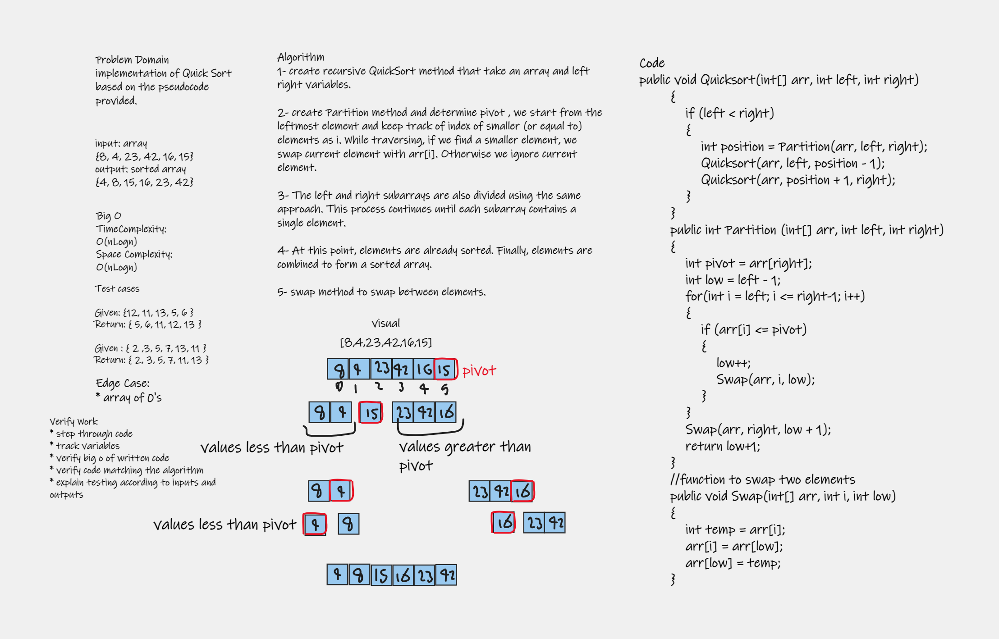
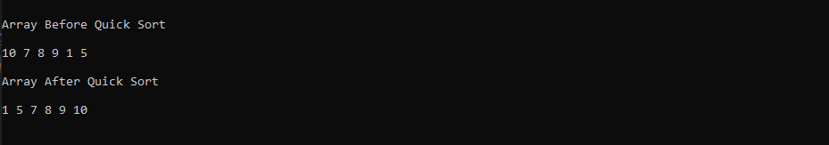

# Challenge Summary

### implementation of Quick Sort based on the pseudocode provided.

# Whiteboard Process

# Approach & Efficiency

1- create recursive QuickSort method that take an array and left right variables, Sort the left , Sort the right 

2- create Partition method and determine pivot, we start from the leftmost element and keep track of index of smaller (or equal to) elements as i. While traversing, if we find a smaller element, we swap current element with arr[i]. Otherwise we ignore current element. 

3- The left and right subarrays are also divided using the same approach. This process continues until each subarray contains a single element.

4- At this point, elements are already sorted. Finally, elements are combined to form a sorted array.

5- swap method to swap between elements.

# Big O

### Time Complexity: O(n*logn)

### Space Complexity: O(n*logn)

# Solution 

[BLOG](BLOG.md) 
