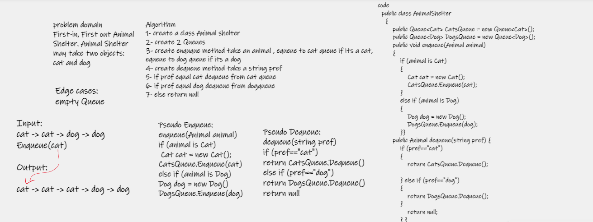

# Challenge Summary

First-in, First out Animal Shelter.

# Whiteboard Process



# Approach & Efficiency

### Enqueue(animal) : Time O(1) / Space O(1)

### Dequeue(pref) : Time O(1) / Space O(1)

# API

### Enqueue(animal): 

* Arguments: animal

* animal can be either a dog or a cat object.

### Dequeue(pref): 

* Arguments: pref

  pref can be either "dog" or "cat"

* Return: either a dog or a cat, based on preference.

  If pref is not "dog" or "cat" then return null.

### Result
```
  public class AnimalShelter
    {
        public Queue<Cat> CatsQueue = new Queue<Cat>();
        public Queue<Dog> DogsQueue = new Queue<Dog>();

        public void enqueue(Animal animal)
        {
            if (animal is Cat)
            {
                Cat cat = new Cat();
                CatsQueue.Enqueue(cat);
            }
            else if (animal is Dog)
            {
                Dog dog = new Dog();
                DogsQueue.Enqueue(dog);
            }
        }

        public Animal dequeue(string pref) {
            if (pref=="cat")
            {
                return CatsQueue.Dequeue();
       
            } else if (pref=="dog")
            {
                return DogsQueue.Dequeue();
            }
                return null;
            }
    }
```
