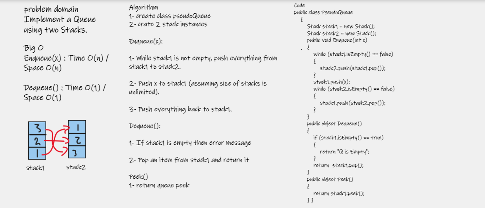

# Challenge Summary

Implement a Queue using two Stacks.

# Whiteboard Process



# Approach & Efficiency

### Enqueue(x) : Time O(n) / Space O(n)

### Dequeue() : Time O(1) / Space O(1)

# API

### Enqueue(x): 

1- While stack1 is not empty, push everything from stack1 to stack2.

2- Push x to stack1 (assuming size of stacks is unlimited).

3- Push everything back to stack1.

### Dequeue(): 

1- If stack1 is empty then error message

2- Pop an item from stack1 and return it

### Peek()

1- return queue peek

### Result
```
 PseudoQueue q = new PseudoQueue();
            q.Enqueue(1);
            q.Enqueue(2);
            q.Enqueue(3);
            Console.WriteLine("Peek is :" + q.Peek());
            q.Dequeue();
            Console.WriteLine("Peek after Dequeue is :" + q.Peek());
```
