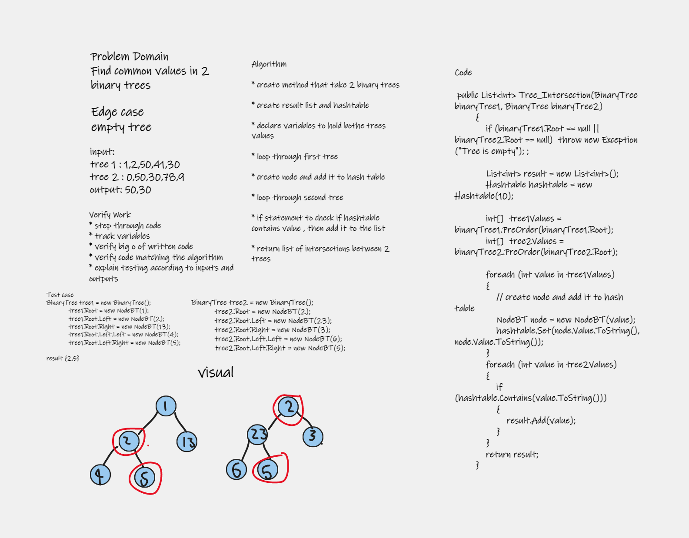
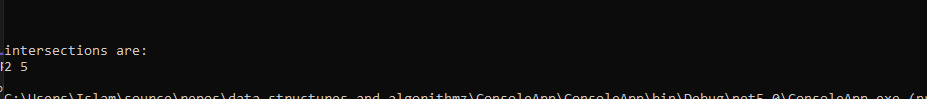

# Challenge Summary

Find common values in 2 binary trees.

# Whiteboard Process



# Approach & Efficiency

* create method that take 2 binary trees

* create result list and hashtable

* declare variables to hold bothe trees values

* loop through first tree

* create node and add it to hash table

* loop through second tree

* if statement to check if hashtable contains value , then add it to the list

* return list of intersections between 2 trees

Time Complexity : O(n)

Space Complexity : O(n)

# Solution

run file ctrl + f5

```
            BinaryTree tree1 = new BinaryTree();
            tree1.Root = new NodeBT(1);
            tree1.Root.Left = new NodeBT(2);
            tree1.Root.Right = new NodeBT(13);
            tree1.Root.Left.Left = new NodeBT(4);
            tree1.Root.Left.Right = new NodeBT(5);

            BinaryTree tree2 = new BinaryTree();
            tree2.Root = new NodeBT(2);
            tree2.Root.Left = new NodeBT(23);
            tree2.Root.Right = new NodeBT(3);
            tree2.Root.Left.Left = new NodeBT(6);
            tree2.Root.Left.Right = new NodeBT(5);
```

